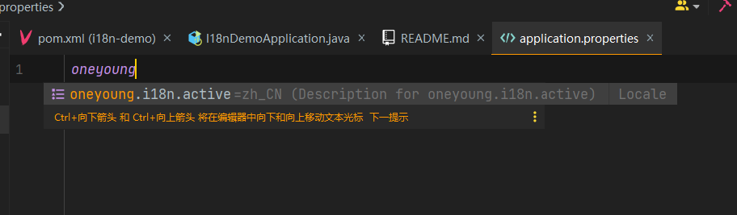
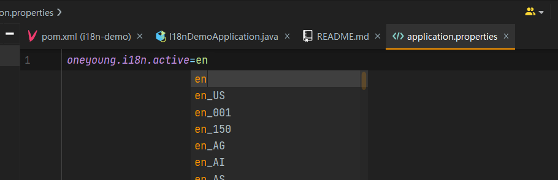

# spring boot 集成 oneyoung-i18n
## 引入依赖
```xml
        <dependency>
            <groupId>top.oneyoung</groupId>
            <artifactId>oneyoung-i18n-starter</artifactId>
            <version>0.0.4</version>
        </dependency>
```
## 配置激活的语言
默认激活的语言是`zh_CN`
```properties
oneyoung.i18n.active=en_US
```
支持IDEA自动推断


## 添加错误码配置文件
`src/main/resources/i18n/errors_en_US.properties` en_US
```properties
ONEYOUNG-EXCEPTION=oneyoung demo exception
```
`src/main/resources/i18n/errors_zh_CN.properties` zh_CN
```properties
ONEYOUNG-EXCEPTION=oneyoung demo 测试异常
```
目前暂支持两种语言，后续会继续开发更灵活的配置方式，支持多种语言

## 使用
### 获取默认激活语言的message
```java
ErrorMessage.of("ONEYOUNG-EXCEPTION").getMessage();
```

### 获取指定语言的message
```java
ErrorMessage.of(Locale.CHINA,"ONEYOUNG-EXCEPTION").getMessage();
```

